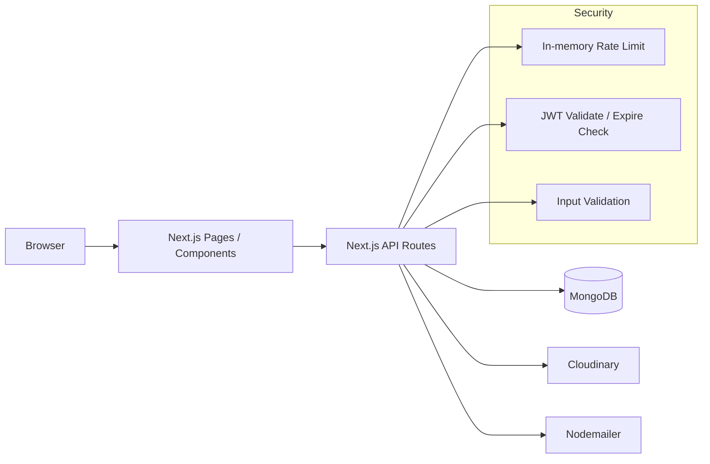

# Unsplash Clone (Next.js Full-Stack)

A full-stack photo platform built with Next.js, React, and MongoDB.

This project demonstrates end-to-end product delivery:
- Frontend: upload workflow, photo feed, auth UI, account settings
- Backend: API Routes, MongoDB models, JWT auth, password reset, baseline security hardening


---

## 🚀 Demo
- Frontend: [https://unsplash-clone-nextjs.vercel.app/](https://unsplash-clone-nextjs.vercel.app/)

---

## 🛠 Tech Stack

### Frontend
- Next.js (Pages Router)
- React + TypeScript
- Redux Toolkit
- MUI + SCSS/Tailwind

### Backend
- Next.js API Routes
- MongoDB + Mongoose
- JWT / bcrypt
- Nodemailer (forgot password flow)
- Cloudinary (image upload)

---

## 🧱 Architecture Diagram



---

## ✨ Features

- Email signup / login
- Profile editing / password change / account closure
- Forgot password (email + reset token)
- Image upload (Cloudinary)
- Photo feed pagination, category tags, likes

---

## 🔌 API Examples (Standardized Response Format)

### 1) Login
`POST /api/user/login`

Request:
```json
{
    "email": "demo@example.com",
    "password": "password123"
}
```

Success:
```json
{
    "status": 200,
    "code": "LOGIN_SUCCESS",
    "message": "Login successful",
    "data": {
        "token": "<jwt>",
        "userInfo": { "_id": "...", "email": "demo@example.com" }
    }
}
```

Error:
```json
{
    "status": 401,
    "code": "INVALID_CREDENTIALS",
    "message": "Invalid credentials",
    "data": null
}
```

### 2) Create User
`POST /api/user/create-user`

Request:
```json
{
    "email": "demo@example.com",
    "password": "password123",
    "userName": "demo_user",
    "firstName": "Demo",
    "lastName": "User"
}
```

### 3) Photo Upload
`POST /api/photo/upload` (Bearer token required)

Request:
```json
{
    "photos": [
        {
            "url": "https://res.cloudinary.com/...",
            "publicId": "abc123",
            "tabs": ["Nature", "Travel"],
            "location": "Tokyo",
            "description": "city night"
        }
    ]
}
```

---

## 🔐 Security & Validation
- JWT token expiry/invalid handling (middleware + API)
- Basic rate-limiting for Login / Forgot Password / Reset Password
- API input validation:
    - email format
    - minimum password length
    - photos payload structure and tabs length limits
- Unified login error messages (to reduce account enumeration risk)

> Note: current rate-limiting is single-instance in-memory; Redis is recommended for multi-instance deployments.

---

## ⚙️ Local Setup

```bash
pnpm install
pnpm dev
```

Production build:
```bash
pnpm build
pnpm start
```

---

## 🔧 Environment Variables (.env)

```bash
MONGODB_URI=
JWT_SECRET=
MAIL_PASS=
NEXT_PUBLIC_DOMAIN=http://localhost:3000

NEXT_PUBLIC_CLOUDINARY_CLOUD_NAME=
NEXT_PUBLIC_CLOUDINARY_UPLOAD_PRESET=
```

Descriptions:
- `MONGODB_URI`: MongoDB connection string
- `JWT_SECRET`: JWT signing secret
- `MAIL_PASS`: email provider app password (forgot password flow)
- `NEXT_PUBLIC_DOMAIN`: base domain used to build reset links
- `NEXT_PUBLIC_CLOUDINARY_*`: Cloudinary upload settings

---

## ✅ Testing (Manual Checklist)

There is currently no automated test suite. Manual verification flow:
1. Sign up → Login
2. Upload photo → verify it appears on the homepage
3. Like / Unlike
4. Forgot password email → Reset password
5. Update profile and avatar


---

## 👤 Demo Account


- Email: `demo@example.com`
- Password: `Demo1234!`

Notes:
- Credentials may be rotated periodically.
- Do not upload sensitive or private data.

---

## ⚖️ Technical Decisions & Trade-offs
- **Next.js API Routes**: fast iteration in a single repo; can be split into a dedicated backend service when scale/ownership grows.
- **In-memory rate limit**: zero infra cost for MVP; not shared across multiple instances.
- **Standardized API response shape**: simpler and more consistent frontend error handling.
- **Shared API client/functions**: pages no longer depend on raw URLs, reducing maintenance overhead.

---

## 📁 Project Structure (High Level)

```text
components/
lib/
pages/
    api/
public/
store/
styles/
types/
```

---

## 🗺 Roadmap
- [ ] Add automated API integration tests
- [ ] Move rate-limiting store to Redis
- [ ] Add CI pipeline (lint + build + test)
- [ ] Improve query/cache performance for photo feed

---

## UI / UX Reference

The interface and user flow are inspired by Unsplash.
This project is for technical practice and portfolio demonstration only, not for commercial use.
